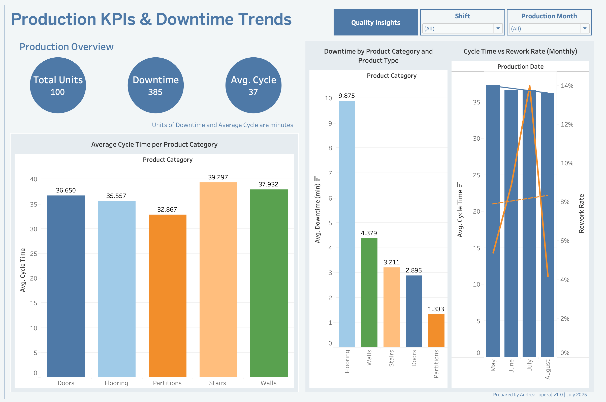

# Production Line Intelligence Dashboard

A simulated manufacturing analytics project for tracking KPIs, downtime, and rework using **Python**, **SQL**, and **Tableau**.

---

## Project Purpose

This project simulates a production environment to showcase operational analytics skills — from data generation to interactive reporting.

**Tools:** `Python` · `pandas` · `matplotlib/seaborn` · `SQL` · `Tableau`  
**Skills:** KPI monitoring · Root cause analysis · Dashboarding · Data simulation · Operational analytics

---

## Phase 1: Define the Process + Simulate Data

We defined a 3-shift glass production process and simulated operational data using Python.

### Key Details:
- **Units produced**: 300  
- **Shifts**: 3 per day  
- **Product categories**: Doors, Walls, Flooring, Stairs, Partitions  
- **Metrics**:
  - Processing times (cutting, tempering, framing)
  - Downtime minutes
  - Quality check result + rework flag
  - Rework reason (for failures only)

### Files:
- `notebooks/01_data_simulation.ipynb` – Python code to simulate production data  
- `data/production_data.csv` – Final output (ready for analysis)

---

## Phase 2: Exploratory Data Analysis

We explored the simulated production dataset to uncover trends in processing time, rework, and downtime.

### Key Analyses:
- Units produced per shift
- Average cycle time by product category
- Rework rates by shift
- Downtime patterns by product type
- Distribution of rework reasons

### Key Insights:
- All three shifts produced equal volume
- Stairs and Walls had the longest average cycle times
- Rework rate averaged ~9%, highest in Shift 1
- Downtime was highest for Stairs and Flooring
- Most common rework reason: Misaligned Frame

### Files:
- `notebooks/02_eda.ipynb`  
- Charts: `plots/`

---

## Phase 3: Dashboard with Tableau

In this phase, we transformed the CSV data into an interactive Tableau dashboard to simulate real-time monitoring for manufacturing operations.

### Visuals:
- Bar Chart: Units produced per shift  
- Pie Chart: Rework reason distribution  
- KPI Cards: Total Units, Rework Rate, Avg Cycle Time  
- Line Chart: Units over time  
- Filters: Product category, Shift, Rework flag  

### Dashboard with Tableau:
Here's a preview of the final interactive dashboard built in Tableau Public:

[]

> [🔗 View Tableau Dashboard ([click here](https://public.tableau.com/app/profile/andrea.lopera/viz/ProductionKPIsDowntimeTrends/ProductionOverview))]

### Files:
- Tableau Workbook: `dashboards/production_dashboard.twbx`  
- Preview: `dashboards/screenshots/`

---

## 🧩 Project Goal

By the end, this dashboard will help:
- Monitor process efficiency and product quality  
- Identify shifts or product types with high rework or downtime  
- Demonstrate analytics and reporting skills using realistic operations data  

> 📌 This project is part of a career portfolio in **manufacturing analytics** and **process intelligence**.

